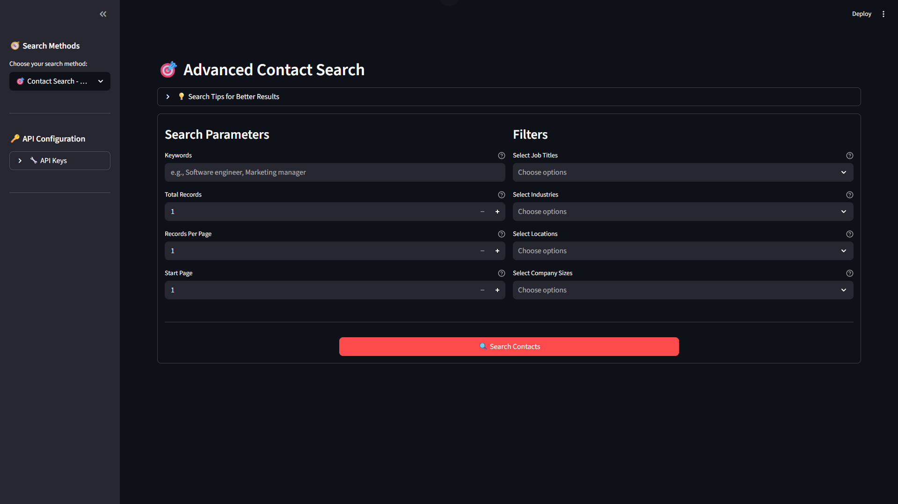
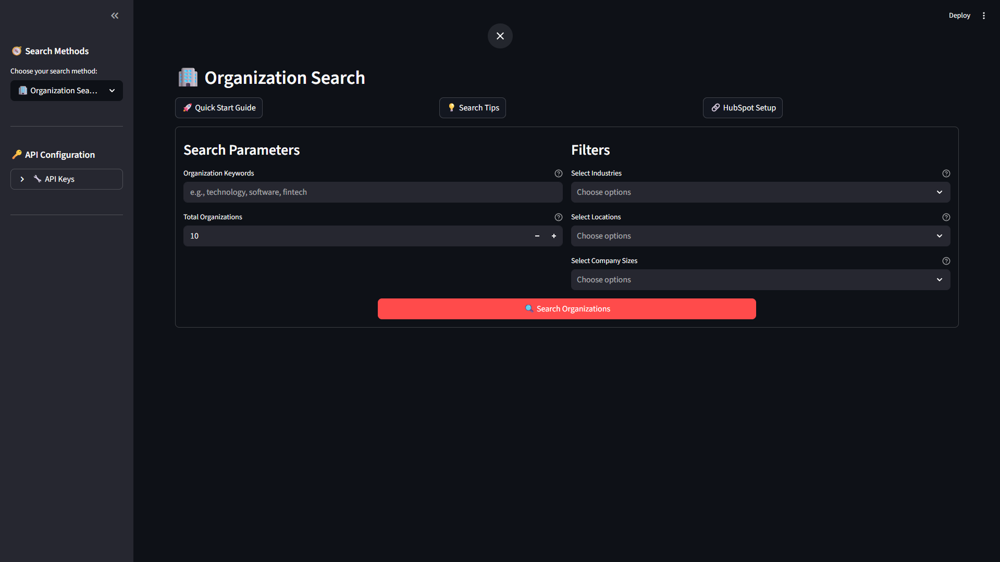
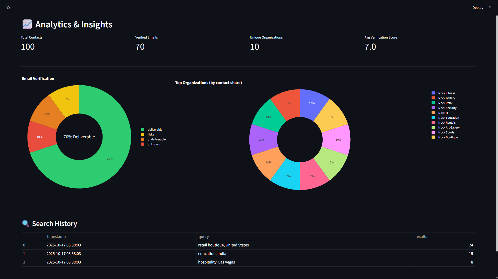
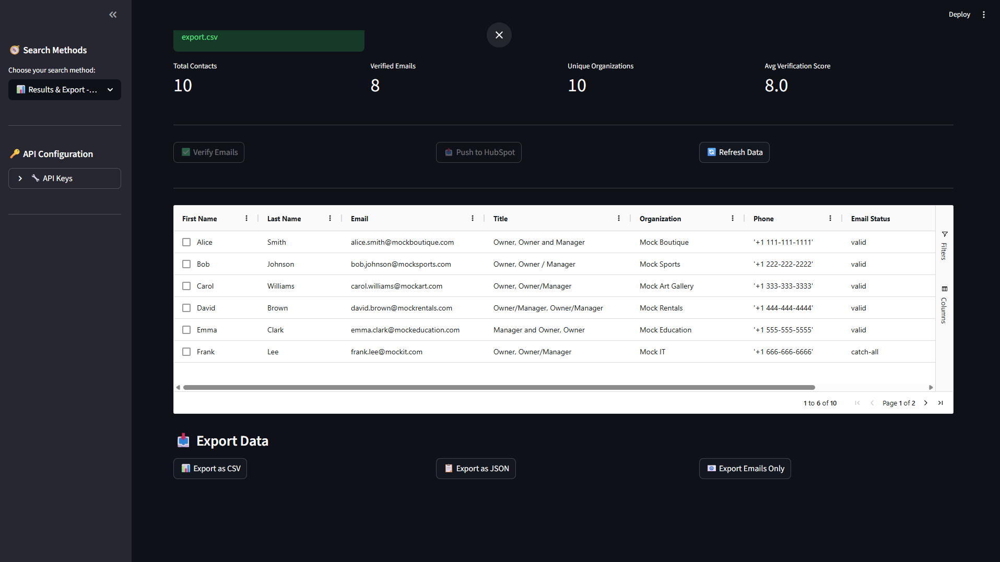

# 🎯 LeadHunter

**Discover new leads, validate emails, and enrich your CRM in one seamless platform.**
LeadHunter combines **FastAPI’s speed, Streamlit’s interactivity**, and integrations with Apollo.io, Hunter.io, and HubSpot to make your lead management smarter, faster, and effortless.


## 🚀 Features

- **🔍 Advanced Company & Contact Search**
Filter by keywords, location, industry, and company size.
- **✅ [Hunter.io](http://hunter.io/) Email Verification**
Instantly verify contacts through API.
- **📤 HubSpot Integration**
Send companies and contacts to HubSpot CRM with one click.
- **📈 Analytics Dashboard**
View verification results, organization insights, and performance visualizations.
- **📦 Flexible Export**
Download data as CSV, JSON, or email lists.
- **💻 Streamlit UI**
Fast, modern, and user-friendly interface.


### 🎯 Contact Search

### 🏢 Organization Search

### 📈 Analytics

### 📊 Results & Export



## ⚡️ Quick Start


```bash
git clone https://github.com/sametcankoksoy/LeadHunter
cd LeadHunter
python -m venv .venv
source .venv/bin/activate  # On Windows: .venv\scripts\activate
pip install -r requirements.txt
streamlit run app.py

```
